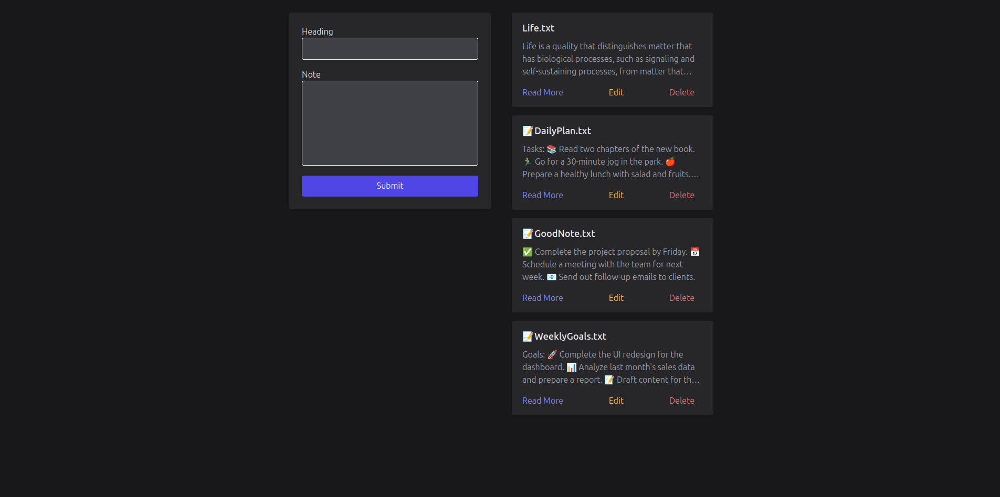
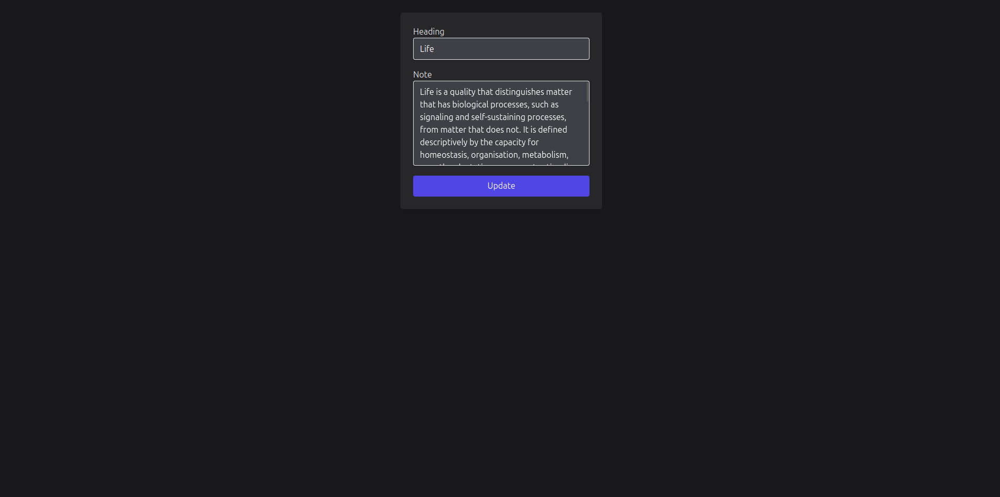

<h1>Note App</h1>

Welcome to the Note App project! This project is a simple note-taking application that uses the <code>fs</code> module in Node.js for data storage instead of a database like MongoDB.

<h2>Live Demo</h2>

Check out the live demo of the project: <a href="https://noteapp-pnzu.onrender.com/">https://noteapp-pnzu.onrender.com/</a>

<h2>Screenshots</h2>

<h3>Home Page</h3>

<h3>Edit Page</h3>

<h2>Features</h2>
<ul>
  <li>Create new notes</li>
  <li>View existing notes</li>
  <li>Edit existing notes</li>
  <li>Delete notes</li>
</ul>

<h2>Installation</h2>

To get a local copy up and running, follow these simple steps:

<ol>
  <li>Clone the repository</li>
  <pre><code>git clone https://github.com/Sam123336/NoteApp.git</code></pre>
  <li>Navigate to the project directory</li>
  <pre><code>cd NoteApp</code></pre>
  <li>Install dependencies</li>
  <pre><code>npm install</code></pre>
  <li>Start the server</li>
  <pre><code>node index.js</code></pre>
</ol>

<h2>Usage</h2>
<ol>
  <li>Open your browser and navigate to <code>http://localhost:3000</code></li>
  <li>Use the interface to create, view, edit, and delete notes</li>
</ol>

<h2>Contributing</h2>

Contributions are what make the open source community such an amazing place to learn, inspire, and create. Any contributions you make are <strong>greatly appreciated</strong>.

<ol>
  <li>Fork the Project</li>
  <li>Create your Feature Branch (<code>git checkout -b feature/AmazingFeature</code>)</li>
  <li>Commit your Changes (<code>git commit -m 'Add some AmazingFeature'</code>)</li>
  <li>Push to the Branch (<code>git push origin feature/AmazingFeature</code>)</li>
  <li>Open a Pull Request</li>
</ol>

<h2>License</h2>

Distributed under the MIT License. See <code>LICENSE</code> for more information.

<h2>Contact</h2>

Sambit Kumar Ghosh - [Your Email Address]

Project Link: <a href="https://github.com/Sam123336/NoteApp">https://github.com/Sam123336/NoteApp</a>

